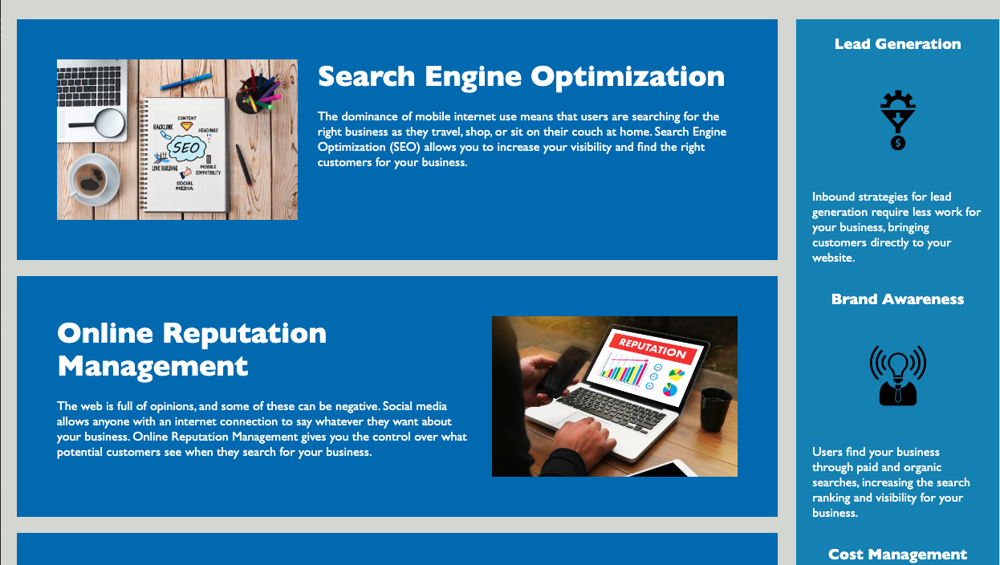

# Student Mini Project 1 - Code refactor for Horiseon website

## Description

A refactoring of code for the Horiseon website. 
The client wanted a smoother HTML file styled semantically. 
The client wanted a CSS file that was tighter and organized in a flow that was consistant with the HTML file.
The look of the page and the links were not altered, but the HTML and CSS was condensed and commented properly.
During the process of refactoring I learned how to properly comment and condense existing code, how to alter HTML semantically without 
changing the output, and how to deploy and launch websites through GitHub pages.
I learned how to use semantic HTML to provide more accessibility to the webpage.
I also learned how to write a quality README file using markdown.

You can find the site here:

https://github pages link

## Images

## Credits

This project was completed by Phillip Pfister.

For tools about how to write semantic HTML I refered to the "Internetting is Hard" website section on sematic HTML:
[https://www.internetingishard.com/html-and-css/semantic-html/]

For condensing CSS files using various selectors I referred to "Envatotuts" tutorial pages on CSS:
[https://code.tutsplus.com/tutorials/the-30-css-selectors-you-must-memorize--net-16048]

I also referred to Mozilla's MDN website for various tips on HTML and CSS.
[https://developer.mozilla.org/en-US/]

## License

© 2023 Phillip Pfister. Confidential and Proprietary. All Rights Reserved.

---

